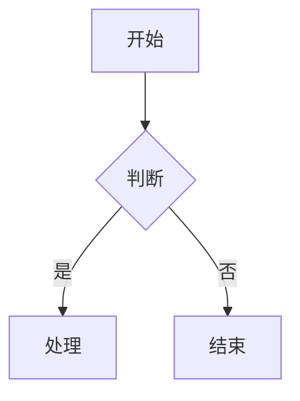

<h1 align="center">Typora Next</h1>

<p align="center">
  <strong>重预览、轻编辑的现代化 Markdown 预览器</strong>
</p>

<p align="center">
  
  
  
  
  
</p>

<p align="center">
  <a href="#-快速开始"></a>
  <a href="#-功能特性"></a>
  
</p>

Typora Next 是一款面向技术文档撰写者的 Markdown 预览器。它在 VS Code 或 Obsidian 中编辑文档的同时，提供超越 Typora 的渲染质量——极致的数学公式渲染、丰富的图表支持、精美的代码高亮，以及项目级的文档管理能力。

---

## ✨ 核心功能

| 功能 | 说明 |
|------|------|
| **Markdown 渲染** | 基于 `pulldown-cmark`，支持 CommonMark + GFM（表格、任务列表、删除线、Alerts） |
| **数学公式** | KaTeX 驱动，支持行内 `$...$` 和块级 `$$...$$` 公式，速度比 MathJax 快 10 倍 |
| **代码高亮** | Prism.js 本地化部署，支持 20+ 语言，带行号和一键复制按钮 |
| **Mermaid 图表** | 支持流程图、时序图、甘特图、类图等 13 种图表类型，渲染失败可 AI 修复 |
| **图片处理** | 本地相对路径 + 网络图片，支持 Lightbox 放大查看 |
| **项目文件树** | 打开文件夹，侧边栏显示目录结构，支持搜索过滤 |
| **多标签** | 单窗口多文件 Tab 切换 |
| **主题系统** | 浅色 / 深色主题切换，基于 CSS 变量 |
| **幻灯片放映** | Reveal.js 驱动，支持 `---`/`--` 翻页、fragment 动画、数学/图表/代码渲染 |
| **图片 Lightbox** | 点击放大查看，支持键盘导航 |
| **任务列表交互** | 点击 checkbox 实时切换状态并写回文件 |
| **最近打开文件** | 记录并快速访问最近打开的文档 |
| **YAML Frontmatter** | 卡片化渲染文档元数据 |
| **Word 导出** | 精美模式导出 DOCX |
| **PDF 导出** | 保留渲染样式直接导出 PDF |
| **文件刷新提示** | 检测外部编辑器修改，自动提示刷新 |

---

## 🤔 为什么需要这个项目？

现有 Markdown 预览工具存在以下痛点：

- **Typora**：闭源且收费，数学渲染依赖 MathJax 较慢，图表支持有限
- **VS Code 预览**：功能基础，无项目级文件管理，无高质量导出
- **Obsidian**：过于复杂，渲染定制性不足

Typora Next 的设计哲学是：

- **编辑器交给专业工具**（VS Code / Obsidian 写文档）
- **预览器专注渲染质量**（数学、图表、代码块做到极致）
- **项目级文档管理**（文件树、多标签、快速搜索）
- **高质量导出交付**（PDF 保留完整样式）

---

## 🚀 快速开始

### 直接下载安装

访问 [Releases](https://github.com/konghaojie-k2/typora-next/releases) 下载最新 MSI 安装包，双击安装即可。

> 系统要求：Windows 10+（WebView2 已内置）

### 从源码编译

前置要求：
- [Rust](https://www.rust-lang.org/tools/install)（1.70+）
- [MinGW](https://www.mingw-w64.org/)（`scoop install mingw`）

```bash
# 克隆项目
git clone https://github.com/konghaojie-k2/typora-next.git
cd typora-next

# 编译桌面应用
cd src-tauri
export PATH="/c/Users/17625/scoop/apps/mingw/15.2.0-rt_v13-rev0/bin:$PATH"
cargo build --release

# 运行
./target/release/app.exe
```

> **Windows 路径空格问题**：如果项目路径包含空格，创建 junction point 后从 junction 路径编译：
> ```powershell
> New-Item -ItemType Junction -Path 'C:\CODE\typora-next' -Target 'C:\CODE\open Typora'
> cd C:\CODE\typora-next\src-tauri
> cargo build --release
> ```

---

---

## 📖 界面预览

### 桌面应用

主界面包含：
- **左侧边栏**：文件树 / 目录 TOC Tab 切换，支持折叠
- **顶部工具栏**：打开文件、切换源码、导出 PDF、切换主题
- **Tab 栏**：多文件标签切换
- **主预览区**：渲染后的 Markdown 内容

### 快捷键

| 快捷键 | 功能 |
|--------|------|
| `Ctrl + O` | 打开文件 |
| `Ctrl + Shift + O` | 打开文件夹 |
| `Ctrl + E` | 切换源码 / 预览模式 |
| `Ctrl + T` | 折叠 / 展开侧边栏 |
| `Ctrl + P` | 导出 PDF |
| `Ctrl + Shift + L` | 切换浅色 / 深色主题 |
| `Ctrl + Shift + P` | 幻灯片放映 |
| `Ctrl + W` | 关闭当前 Tab |

---

## 🎯 功能特性

### 数学公式渲染

基于 KaTeX，支持 LaTeX 语法：

```markdown
行内公式：$E = mc^2$

块级公式：
$$
\int_{a}^{b} f(x) \, dx = F(b) - F(a)
$$
```

### Mermaid 图表

支持 13 种图表类型，渲染失败时提供 **AI 修复** 功能：

```markdown

```

### 代码块增强

- 语法高亮（20+ 语言）
- 左侧行号显示
- 右上角复制按钮
- 语言徽标标识

### 幻灯片放映

基于 Reveal.js，将 Markdown 一键转为演示文稿：

- `---` 水平翻页、`--` 垂直翻页
- `<!-- .element: class="fragment" -->` 页内动画
- 支持数学公式、代码高亮、Mermaid 图表在幻灯片中渲染
- `Esc` 退出放映，`O` 进入概览模式

### AI 修复 Mermaid

当 Mermaid 语法错误时，点击 "AI 修复" 按钮，调用配置的 AI 模型（支持 Anthropic / OpenAI 兼容 API）自动修正语法。

配置方式：设置面板 → 输入 API Key → 选择提供商和模型。

---

## 🗺️ 开发路线

| 阶段 | 内容 | 状态 |
|------|------|------|
| **Phase 1** | P0 核心渲染（Markdown、代码高亮、数学公式） | 已完成 |
| **Phase 2** | P1 扩展功能（Mermaid、图片、Tauri 桌面应用、TOC、源码切换） | 已完成 |
| **Phase 3** | P2 项目管理（文件树、多标签、PDF 导出、主题系统） | 已完成 |
| **Phase 4** | P3 增强功能（AI 修复 Mermaid、文件刷新提示、Word 导出） | 已完成 |
| **Phase 5** | P4 差异化功能（幻灯片放映、Lightbox、任务列表交互、最近文件、Frontmatter） | 已完成 |
| **Phase 6** | P5 Obsidian 兼容 + 文档内搜索 | 计划中 |

---

## 📦 技术栈

- **Backend**: Rust + Tauri 2.x + pulldown-cmark
- **Frontend**: Vanilla JS + KaTeX + Mermaid.js + Prism.js
- **Math Rendering**: KaTeX（行内 + 块级）
- **Diagram Rendering**: Mermaid.js（13 种图表）
- **Code Highlighting**: Prism.js（Tomorrow 主题 + 行号插件）
- **File Watching**: notify (Rust)
- **HTTP Client**: ureq (Rust，用于 AI API 调用)

---

## 📄 开源协议

MIT License

---

<div align="center">

**Typora Next** — *Preview Beautifully, Edit Lightly*

</div>
