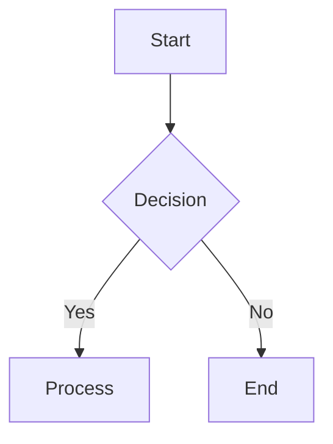

<h1 align="center">Typora Next</h1>

<p align="center">
  <a href="README.md"></a>
  
</p>

<p align="center">
  <strong>A Modern Markdown Previewer — Preview Beautifully, Edit Lightly</strong>
</p>

<p align="center">
  
  
  
  
  
</p>

<p align="center">
  <a href="#-quick-start"></a>
  <a href="#-features"></a>
  
</p>

Typora Next is a Markdown previewer designed for technical documentation writers. While you edit documents in VS Code or Obsidian, it provides rendering quality beyond Typora — exceptional math formula rendering, rich diagram support, elegant code highlighting, and project-level document management.

---

## ✨ Core Features

| Feature | Description |
|---------|-------------|
| **Markdown Rendering** | Based on `pulldown-cmark`, supports CommonMark + GFM (tables, task lists, strikethrough, Alerts) |
| **Math Formulas** | KaTeX-powered, supports inline `$...$` and block `$$...$$` formulas, 10x faster than MathJax |
| **Code Highlighting** | Prism.js local deployment, 20+ languages, line numbers and copy button |
| **Mermaid Diagrams** | 13 diagram types (flowchart, sequence, gantt, class, etc.), AI repair on failure |
| **Image Handling** | Local relative paths + network images + Obsidian WikiLink `![[image.png]]`, Lightbox zoom |
| **Annotation** | WeChat Reading-style annotation — select text → toolbar → highlight/underline/note, auto-persisted |
| **Paragraph Translation** | Full document + selection translation, bilingual display, local cache, viewport lazy-loading |
| **Project File Tree** | Open folder, sidebar directory structure with search filter |
| **Multi-tab** | Single window, multiple file tabs |
| **Theme System** | Light / Dark theme toggle, CSS variables based |
| **Slide Presentation** | Reveal.js-powered, `---`/`--` pagination, fragment animations, WikiLink image rendering |
| **Image Lightbox** | Click to zoom, keyboard navigation |
| **Task List Interaction** | Click checkbox to toggle state and write back to file |
| **Recent Files** | Quick access to recently opened documents |
| **YAML Frontmatter** | Card-style metadata rendering |
| **Word Export** | DOCX export with elegant styling |
| **PDF Export** | Export PDF preserving full rendering styles |
| **Image Download** | Images, Mermaid SVG, table CSV one-click download |
| **Zen Mode** | `F11` toggles — hide all UI controls, maximize reading space |
| **Window Persistence** | Auto-save window position, size, maximize state |
| **File Refresh Alert** | Detect external editor modifications, auto-prompt refresh |
| **Show in Folder** | Tab right-click → open system file manager and locate source file |

---

## 🤔 Why This Project?

Existing Markdown preview tools have pain points:

- **Typora**: Closed-source and paid, slow MathJax rendering, limited diagram support
- **VS Code Preview**: Basic features, no project-level file management, no high-quality export
- **Obsidian**: Overly complex, insufficient rendering customization

Typora Next's philosophy:

- **Editor to Professional Tools** (VS Code / Obsidian for writing)
- **Previewer Focus on Quality** (math, diagrams, code blocks to perfection)
- **Project-level Management** (file tree, multi-tab, quick search)
- **High-quality Export Delivery** (PDF preserving full styles)

---

## 🚀 Quick Start

### Direct Download

Visit [Releases](https://github.com/konghaojie-k2/typora-next/releases) to download the latest MSI installer.

> System Requirements: Windows 10+ (WebView2 built-in)

### Build from Source

Prerequisites:
- [Rust](https://www.rust-lang.org/tools/install) (1.70+)
- [MinGW](https://www.mingw-w64.org/) (`scoop install mingw`)

```bash
# Clone project
git clone https://github.com/konghaojie-k2/typora-next.git
cd typora-next

# Build desktop app
cd src-tauri
export PATH="/c/Users/17625/scoop/apps/mingw/15.2.0-rt_v13-rev0/bin:$PATH"
cargo build --release

# Run
./target/release/app.exe
```

---

## 📖 Interface Preview

### Desktop App

Main interface includes:
- **Left Sidebar**: File tree / TOC tab switch, collapsible
- **Top Toolbar**: Open file, toggle source, export PDF, switch theme
- **Tab Bar**: Multi-file tab switching
- **Main Preview Area**: Rendered Markdown content

### Keyboard Shortcuts

| Shortcut | Function |
|----------|----------|
| `Ctrl + O` | Open file |
| `Ctrl + Shift + O` | Open folder |
| `Ctrl + E` | Toggle source / preview mode |
| `Ctrl + T` | Collapse / expand sidebar |
| `Ctrl + P` | Export PDF |
| `Ctrl + Shift + L` | Toggle light / dark theme |
| `Ctrl + Shift + P` | Slide presentation |
| `Ctrl + W` | Close current tab |
| `F11` | Zen mode |

---

## 🎯 Features

### Math Formula Rendering

Based on KaTeX, supports LaTeX syntax:

```markdown
Inline formula: $E = mc^2$

Block formula:
$$
\int_{a}^{b} f(x) \, dx = F(b) - F(a)
$$
```

### Mermaid Diagrams

13 diagram types with **AI Repair** on failure:

```markdown

```

### Code Block Enhancement

- Syntax highlighting (20+ languages)
- Left-side line numbers
- Top-right copy button
- Language badge indicator

### Slide Presentation

Based on Reveal.js, convert Markdown to presentation:

- `---` horizontal pagination, `--` vertical pagination
- `<!-- .element: class="fragment" -->` in-page animations
- Math formulas, code highlighting, Mermaid diagrams, WikiLink images render in slides
- `Esc` exit, `O` overview mode

### Annotation (WeChat Reading-style)

Select text to show annotation toolbar:

- **5 Colors**: yellow, green, blue, pink, purple
- **2 Styles**: highlight background, underline
- **Notes**: Add text notes to annotations
- **Auto-persist**: Wrapped in `<mark>` tags, restored after re-render

### Paragraph Translation

AI-powered translation:

- **Full Document**: One-click translate entire document, bilingual display
- **Selection Translate**: Translate only selected text
- **Local Cache**: Cached locally, no re-request on reopen
- **Viewport Lazy-load**: Translate visible area first, batch load on scroll

Configuration: Settings panel → Enter API Key → Select provider and model (Anthropic / OpenAI compatible API).

---

## 🗺️ Roadmap

| Phase | Content | Status |
|-------|---------|--------|
| **Phase 1** | P0 Core rendering (Markdown, code highlighting, math formulas) | Completed |
| **Phase 2** | P1 Extended features (Mermaid, images, Tauri desktop app, TOC, source toggle) | Completed |
| **Phase 3** | P2 Project management (file tree, multi-tab, PDF export, theme system) | Completed |
| **Phase 4** | P3 Enhancements (AI repair Mermaid, file refresh alert, Word export) | Completed |
| **Phase 5** | P4 Differentiation (slide presentation, Lightbox, task list interaction, recent files, Frontmatter) | Completed |
| **Phase 6** | P5 Obsidian compatibility (WikiLink images, WikiLink links), annotation, translation | Completed |
| **Phase 7** | P6 Document search, user feedback portal | In Progress |

---

## 📦 Tech Stack

- **Backend**: Rust + Tauri 2.x + pulldown-cmark
- **Frontend**: Vanilla JS + KaTeX + Mermaid.js + Prism.js
- **Math Rendering**: KaTeX (inline + block)
- **Diagram Rendering**: Mermaid.js (13 diagram types)
- **Code Highlighting**: Prism.js (Tomorrow theme + line numbers plugin)
- **File Watching**: notify (Rust)
- **HTTP Client**: ureq (Rust, for AI API calls)

---

## 📄 License

MIT License

---

<div align="center">

**Typora Next** — *Preview Beautifully, Edit Lightly*

</div>