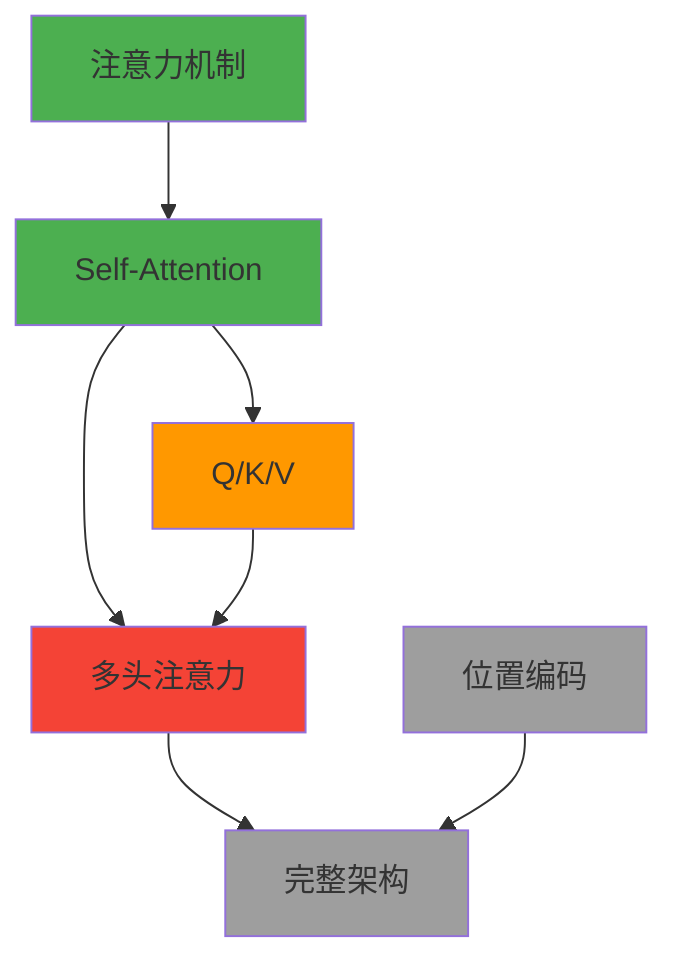

# AI 学习设计师 —— 学习项目功能设计

## 1. 设计目标

将 Typora Next 从"Markdown 预览器"升级为"AI 时代下的学习神器"。

核心定位：用户设定一个学习目标，AI 扮演"学习设计师"，自动规划学习路径、生成深入浅出的学习材料、出题检验、追踪掌握状态。

## 2. 核心概念：学习项目

**学习项目**是一个特殊的文件夹，里面包含一组由 AI 设计的 Markdown 文档，围绕一个学习目标展开。

和普通"打开文件夹"的区别：

| | 普通文件夹 | 学习项目 |
|--|-----------|---------|
| 文档来源 | 用户自己放的 | AI 生成 + 用户可编辑 |
| 文档关系 | 平级，无关联 | 有依赖顺序，形成学习路径 |
| 元数据 | 无 | 每篇文档有学习状态、难度、预计时长 |
| 交互 | 纯阅读 | 嵌入测验、知识卡片、思维导图 |

**项目文件结构**（用户可见）：

```
📁 理解 Transformer/
├── .learning/                  # 隐藏目录，存项目元数据
│   ├── project.json            # 目标、进度、创建时间
│   ├── knowledge-graph.json    # 概念关联图（给 AI 推理用）
│   └── quiz-history.json       # 测验记录
├── 00-为什么学这个.md
├── 01-注意力机制的本质.md
├── 02-从 RNN 到 Self-Attention.md
├── 03-多头注意力图解.md
├── 04-位置编码.md
├── 05-完整架构一览.md
├── 06-动手写一个 Transformer.md
└── 07-总结与知识卡片.md
```

`.learning/` 是隐藏目录，存 AI 生成的元数据，用户一般不用碰。所有学习文档都是标准 Markdown，可以用 VS Code/Obsidian 编辑，用 Typora Next 阅读时才有"学习模式"的交互增强。

**设计原则**：AI 生成的是**起点**，不是终点。用户可以随时编辑、增删、调整顺序。AI 设计师会自适应。

## 3. AI 学习设计师的工作流程

整个流程像一场**对话式协作**，不是一次性生成完就结束。

### Step 1：确定学习目标

用户点击工具栏"新建学习项目"按钮，弹出一个简洁的对话框：

```
你想学什么？
[ 我想理解 Transformer 的工作原理        ]

难度级别：
( ) 小白  (●) 有编程基础  ( ) 专业进阶

预计投入时间：
[ 3 小时 ▼ ]
```

AI 收到后，不直接生成文档，而是先输出一个**学习大纲**让用户确认：

```
📋 AI 设计的学习路径（预计 3 小时）

1. 为什么学这个（10 min）— 了解 Transformer 为什么重要
2. 注意力机制的本质（25 min）— 从人类注意力类比切入
3. 从 RNN 到 Self-Attention（30 min）— 讲清楚"为什么不用 RNN 了"
4. 多头注意力图解（25 min）— 可视化讲解，含交互式图表
5. 位置编码（20 min）— 为什么需要、怎么实现
6. 完整架构一览（20 min）— 把所有组件串起来
7. 动手实现（30 min）— 一个极简 PyTorch 实现
8. 总结与知识卡片（10 min）— 复习 + 生成记忆卡片

[ 看起来不错，开始生成 ]  [ 调整大纲 ]
```

### Step 2：逐章生成

用户确认后，AI 开始**逐章生成**文档（不是一次性全生成，而是一章一章来，用户可以边读边等）。

每章生成时会调用 Typora Next 的强项：
- 数学公式：KaTeX 渲染
- 图表：Mermaid 流程图、架构图
- 代码：Prism.js 高亮 + 行号

### Step 3：阅读 + 交互

用户阅读时，文档里有特殊的学习元素：
- 关键概念鼠标悬停显示**快速解释**
- 每章末尾有**自测题**（选择题 + 简答题）
- 不懂的地方可以选中批注，AI 会针对批注**深化讲解**

### Step 4：迭代优化

如果测验得分低，AI 建议"这个知识点需要加强"，可以：
- 在当前章节内补充更简单的例子
- 插入一个新的"加餐"章节
- 生成额外的练习题

整个流程是**循环的**，不是线性的。

## 4. 学习模式渲染

学习项目里的 Markdown 文档，在 Typora Next 中打开时会自动进入**学习模式**。

### 4.1 沉浸式阅读头部

文档顶部有一个固定的小横条，显示：
```
🎯 理解 Transformer  |  第 3/8 章  |  预计 25 分钟  |  [标记为已完成 ✓]
```

点击"标记为已完成"后，文件树中该文档图标变成 ✅，进度条更新。

### 4.2 学习元素（Learning Elements）

通过特殊的 Markdown 语法扩展（Obsidian 兼容风格）：

```markdown
> [!concept] 注意力机制
> 注意力机制的核心思想是：不是把所有信息都看完，而是**选择性地关注重要部分**。
> 就像你在嘈杂的餐厅里，能专注于同桌人的对话，而忽略周围的噪音。

> [!question] 思考一下
> 为什么 RNN 处理长文本时会"忘记"开头的信息？
> > [!answer] 点击查看解释
> > 因为 RNN 的梯度在反向传播时会逐层衰减...

> [!quiz]
> 1. Self-Attention 的核心优势是什么？
>    - A. 计算速度更快
>    - B. 能并行处理整个序列 ✓
>    - C. 不需要位置编码
```

这些 `!concept`、`!question`、`!quiz` 块在普通 Markdown 编辑器里显示为普通的 callout，在 Typora Next 学习模式下渲染成精美的交互卡片。

### 4.3 章节末的"掌握检查"

每章最后自动附加一个"掌握了吗？"区域，AI 根据本章内容生成 3-5 道测验题。用户作答后，AI 判断掌握程度：
- 🟢 完全掌握 → 推荐进入下一章
- 🟡 基本理解 → 建议复习标红概念
- 🔴 需要加强 → 生成加餐内容或简化版讲解

### 4.4 和普通文档的兼容

- 学习文档就是标准 Markdown，任何地方都能打开
- 只有 Typora Next 会识别 `.learning/` 元数据并启用学习模式
- 用户用 VS Code 编辑时，这些 callout 就是普通的 GitHub Alert 语法

## 5. 知识状态追踪

学习项目的核心不是文档，而是**用户对知识的掌握状态**。

### 5.1 进度模型

每个学习项目有一个 `project.json`：

```json
{
  "goal": "理解 Transformer 的工作原理",
  "created_at": "2026-05-29",
  "total_chapters": 8,
  "completed_chapters": 3,
  "concepts": {
    "注意力机制": { "status": "mastered", "source_chapter": "01" },
    "Self-Attention": { "status": "learning", "source_chapter": "02" },
    "位置编码": { "status": "not_started", "source_chapter": "04" },
    "多头注意力": { "status": "struggling", "source_chapter": "03" }
  }
}
```

`status` 有四种：
- `not_started` — 还没读到
- `learning` — 读过但没测验/测验未通过
- `mastered` — 测验通过
- `struggling` — 测验失败，需要加强

### 5.2 遗忘曲线提醒

当用户完成一个项目后，AI 会根据艾宾浩斯遗忘曲线，在 1 天、3 天、7 天后推送"快速复习"——抽取关键概念和错题，生成 5 分钟复习卡片。

### 5.3 数据存储

- 所有状态存在 `.learning/` 目录下的 JSON 文件里
- 不和 Markdown 文档耦合，方便迁移/备份
- 用户随时可以"重置进度"重新学习

## 6. 知识图谱（概念依赖图）

### 6.1 设计原则

知识图谱是**给 AI 推理用的**，不是给用户看的复杂蜘蛛网。用户看到的是简洁的概念进度 + 依赖路径。

### 6.2 图谱数据生成

AI 在生成每章文档时，同时输出概念提取：

```json
{
  "chapter": "03-多头注意力图解.md",
  "concepts": [
    { "id": "multi-head-attention", "name": "多头注意力", "depends_on": ["self-attention", "query-key-value"] },
    { "id": "query-key-value", "name": "Q/K/V 矩阵", "depends_on": ["self-attention"] }
  ]
}
```

全部章节生成后，合并成依赖图，存到 `.learning/knowledge-graph.json`：

```json
{
  "nodes": [
    { "id": "attention", "name": "注意力机制", "chapter": "01" },
    { "id": "self-attention", "name": "Self-Attention", "chapter": "02" },
    { "id": "query-key-value", "name": "Q/K/V", "chapter": "02" },
    { "id": "multi-head-attention", "name": "多头注意力", "chapter": "03" },
    { "id": "pos-encoding", "name": "位置编码", "chapter": "04" },
    { "id": "transformer", "name": "完整架构", "chapter": "05" }
  ],
  "edges": [
    { "from": "attention", "to": "self-attention" },
    { "from": "self-attention", "to": "query-key-value" },
    { "from": "self-attention", "to": "multi-head-attention" },
    { "from": "query-key-value", "to": "multi-head-attention" },
    { "from": "multi-head-attention", "to": "transformer" },
    { "from": "pos-encoding", "to": "transformer" }
  ]
}
```

### 6.3 用户侧展示

左侧 sidebar 新增一个"知识图谱" Tab，用 **Mermaid.js** 渲染（复用现有能力）：



节点颜色根据 `project.json` 里的掌握状态动态设置。点击节点跳转到对应章节。

## 7. 技术架构：Claude Agent SDK 套壳

### 7.1 为什么选 Claude Agent SDK？

Claude Agent SDK（`@anthropic-ai/claude-agent-sdk`）是 Claude Code 的程序化运行时，可以**无头运行**完整的 Agent Loop：

- 不只是调用 API，而是**自主 Agent**（自己决定下一步做什么）
- 内置工具：Read、Edit、Glob、Grep、Bash
- Agent 自己发现文件写错、重新编辑、修复问题
- 流式输出思考过程

这和 OpenClaw 套 PI Agent 的思路完全一致：**Typora Next 做 UI 壳，Claude Agent SDK 做后台大脑**。

### 7.2 系统架构

```
┌─────────────────────────────────────────┐
│         Typora Next (Tauri App)          │
│  ┌──────────┐  ┌─────────────────────┐  │
│  │ 前端 UI   │  │  Rust 后端          │  │
│  │ 学习面板  │◄─┤  - 文件系统操作      │  │
│  │ 知识图谱  │  │  - 启动/管理 Agent   │  │
│  │ 测验界面  │  │  - stdio JSON-RPC   │  │
│  └──────────┘  └──────────┬──────────┘  │
│                           │ spawn       │
│                    ┌──────┴──────┐      │
│                    │ Node.js     │      │
│                    │ Agent SDK   │      │
│                    │ 子进程       │      │
│                    └──────┬──────┘      │
│                           │ HTTP        │
│                    ┌──────┴──────┐      │
│                    │ Claude API  │      │
│                    └─────────────┘      │
└─────────────────────────────────────────┘
```

### 7.3 各层职责

| 层级 | 职责 |
|------|------|
| **前端** | 学习面板 UI、知识图谱渲染、测验界面、进度展示 |
| **Rust 后端** | 启动/停止 Agent 子进程、API Key 安全存储、文件系统操作、向前端转发 Agent 流式输出 |
| **Node.js Agent** | 导入 `@anthropic-ai/claude-agent-sdk`，运行 Agent Loop，调用 Claude API，自主规划学习项目生成 |

### 7.4 Agent 子进程实现

```javascript
// agent-bridge.js (Node.js 子进程)
const { query } = require("@anthropic-ai/claude-agent-sdk");

const SYSTEM_PROMPT = `你是一个学习设计师。你的任务是帮用户创建结构化的学习项目。
你会收到学习目标，然后：
1. 规划学习大纲
2. 逐章生成 Markdown 文档（深入浅出、逻辑连贯、有图表）
3. 每章包含概念解释、思考题、测验题
4. 同时维护知识图谱（概念依赖关系）

所有生成的文档必须保存到指定目录。
你可以使用 Read、Glob、Edit、Bash 工具。`;

async function main() {
  const goal = process.argv[2];
  const projectPath = process.argv[3];

  for await (const message of query({
    prompt: `创建学习项目：${goal}\n保存路径：${projectPath}`,
    systemPrompt: SYSTEM_PROMPT,
    options: {
      allowedTools: ["Read", "Glob", "Edit", "Bash"],
      cwd: projectPath,
    },
  })) {
    console.log(JSON.stringify(message));
  }
}

main();
```

Rust 端启动并转发：

```rust
use std::process::{Command, Stdio};
use std::io::{BufRead, BufReader};

#[tauri::command]
async fn create_learning_project(
    goal: String,
    project_path: String,
    app_handle: AppHandle,
) -> Result<(), String> {
    let mut child = Command::new("node")
        .arg("agent-bridge.js")
        .arg(&goal)
        .arg(&project_path)
        .stdout(Stdio::piped())
        .spawn()
        .map_err(|e| e.to_string())?;

    let stdout = child.stdout.take().unwrap();
    let reader = BufReader::new(stdout);

    for line in reader.lines() {
        let msg: AgentMessage = serde_json::from_str(&line.unwrap()).unwrap();
        app_handle.emit("agent-message", msg).unwrap();
    }

    Ok(())
}
```

### 7.5 依赖安装

用户系统需预装：
```bash
npm install -g @anthropic-ai/claude-code      # Claude Code CLI（认证用）
npm install -g @anthropic-ai/claude-agent-sdk # Agent SDK
```

或打包进应用（Tauri sidecar 机制）。

### 7.6 与直接调 LLM API 的对比

| | 直接调 LLM API | Claude Agent SDK 套壳 |
|--|---------------|----------------------|
| Agent 能力 | 自己实现状态机 | 复用 Claude Code 成熟 Agent Loop |
| 工具调用 | 手动实现 | 内置 Read/Edit/Grep/Bash/File |
| 推理深度 | 单轮/多轮固定 | 真正的自主规划 |
| 代码生成 | Prompt 里塞代码 | Agent 直接写文件到磁盘 |
| 错误恢复 | 手动重试 | Agent 自己发现错误、重新编辑 |
| 依赖 | 无 | 需要 Node.js + Claude Code CLI |

## 8. 新增文件/模块

```
dist/
├── scripts/
│   ├── learning/
│   │   ├── project-manager.js     # 创建/打开/保存学习项目
│   │   ├── progress-tracker.js    # 状态追踪、知识图谱构建
│   │   └── learning-renderer.js   # 学习模式下的 DOM 增强
│   └── main.js                    # 新增：检测 .learning/ 启用学习模式
├── styles/
│   └── learning.css               # 学习模式专属样式
└── index.html                     # 新增：学习项目头部栏、侧边栏图谱 Tab

src-tauri/src/
├── ai_agent.rs                    # 新增：启动 Agent 子进程、stdio 通信
├── lib.rs                         # 新增：tauri commands
└── ...

agent-bridge.js                    # Node.js Agent SDK 桥接脚本
```

## 9. 边界情况

- **用户编辑了 AI 生成的文档** → 下次打开正常渲染，AI 不会覆盖用户修改（除非用户主动"重新生成本章"）
- **AI 生成到一半失败** → 已生成的章节保留，失败章节标记为 `failed`，用户可点击重试
- **大纲生成后用户大幅调整** → AI 根据新的顺序重新生成依赖关系
- **测验时网络断开** → 本地保存答案，联网后批量提交评分
- **Agent SDK 未安装** → 首次使用时引导用户安装，或提供"直接调用 LLM API"的降级模式

## 10. 实现优先级

| 阶段 | 内容 | 估算 |
|------|------|------|
| Phase 1 | 学习项目基础 UI（新建对话框、项目头部栏、文件树图标状态） | 2h |
| Phase 2 | Rust 后端：启动 Agent 子进程 + stdio 通信 + 前端事件转发 | 3h |
| Phase 3 | Agent SDK 集成：大纲生成 + 逐章生成 + 文件保存 | 4h |
| Phase 4 | 学习模式渲染：concept/question/quiz 卡片 + 测验 UI | 3h |
| Phase 5 | 进度追踪：掌握状态 + 知识图谱渲染 + 遗忘曲线提醒 | 2h |
| Phase 6 | 边界处理：错误恢复、降级模式、用户编辑冲突 | 2h |
