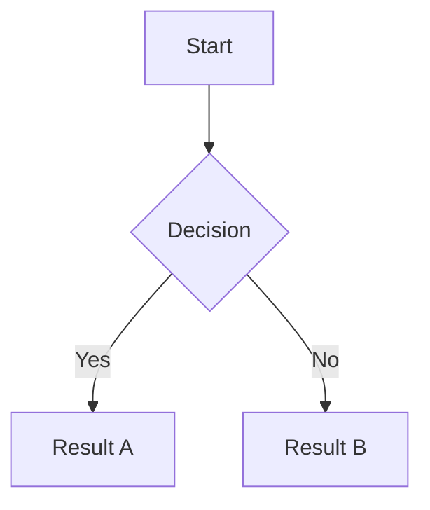
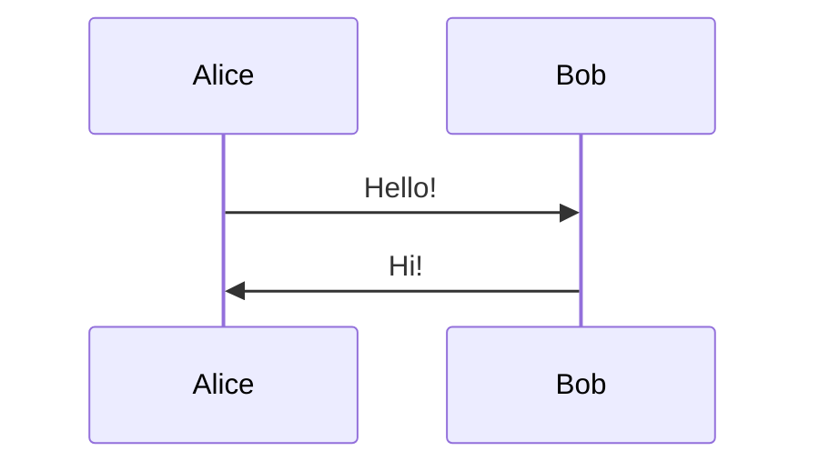

# Math and Mermaid Test

## Math Formula

The equation $E = mc^2$ is Einstein's famous formula.

$$
\int_0^\infty e^{-x^2} dx = \frac{\sqrt{\pi}}{2}
$$

## Mermaid Diagram

```mermaid
flowchart TD
    A[Start] --> B{Decision}
    B -->|Yes| C[Result A]
    B -->|No| D[Result B]
```

## Sequence Diagram

```mermaid
sequenceDiagram
    participant A as Alice
    participant B as Bob
    A->>B: Hello!
    B->>A: Hi!
```