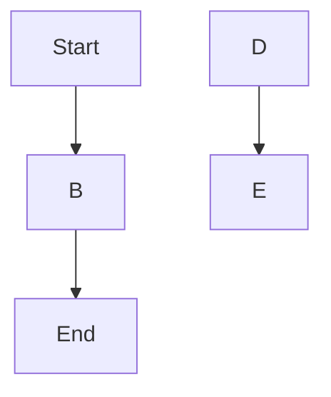
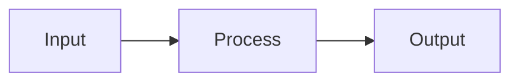

# Mermaid Error Test

## 错误 1：缺少闭合括号

```mermaid
flowchart TD
    A[Start] --> B{Is it working?}
    B -->|Yes| C[Great!]
    B -->|No| D[Debug]
    D --> B
    C --> E[End
```

`E[End` 少了一个右括号 `]`。

## 错误 2：非法箭头语法

```mermaid
flowchart LR
    A[Input] ==>> B[Process]
    B --->>> C[Output]
```

`==>>` 和 `--->>>` 不是合法的 Mermaid 箭头。

## 错误 3：未闭合的字符串引号


字符串内部的 `"` 没有正确转义或闭合。

## 错误 4：缺少节点定义



`B`、`D`、`E` 被引用但没有定义形状。

## 错误 5：错误的 subgraph 语法（缺少 end）

```mermaid
flowchart TB
    subgraph Group A
        A[Task 1]
        B[Task 2]

    A --> B
    B --> C[Done]
```

`subgraph` 缺少 `end` 关键字。

## 正确的图表（对比用）


