# Mermaid Diagrams Test

## Flowchart Examples

### Simple Flowchart

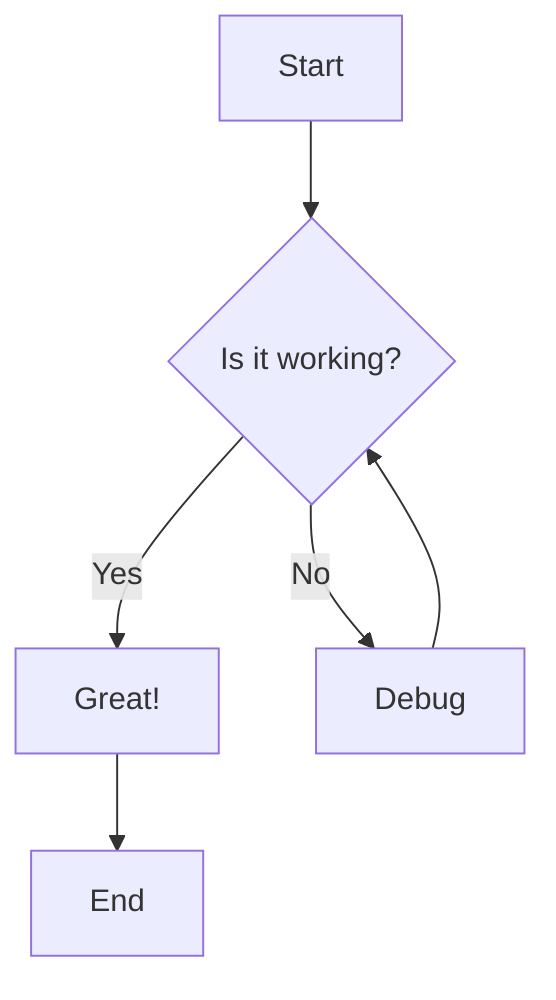

### Horizontal Flowchart

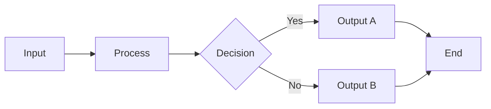

### Complex Flowchart with Subgraphs

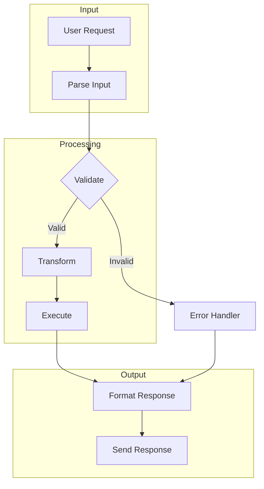

### Flowchart with Different Shapes

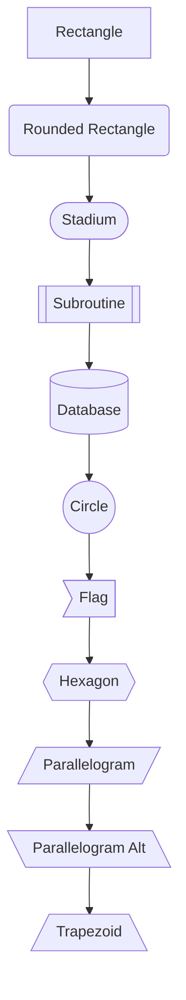

## Sequence Diagram Examples

### Simple Sequence Diagram

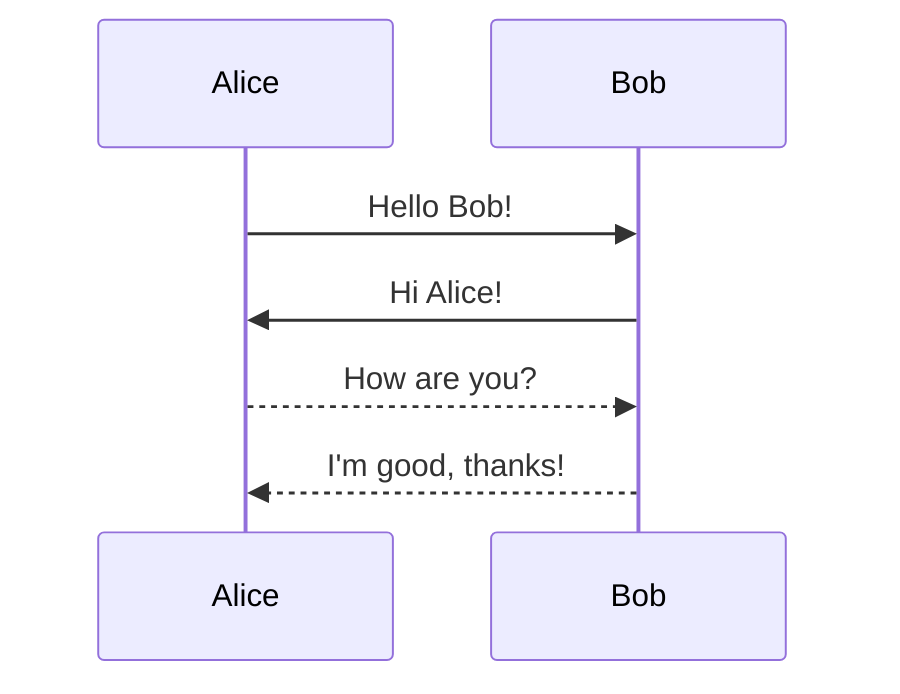

### Sequence Diagram with Loops

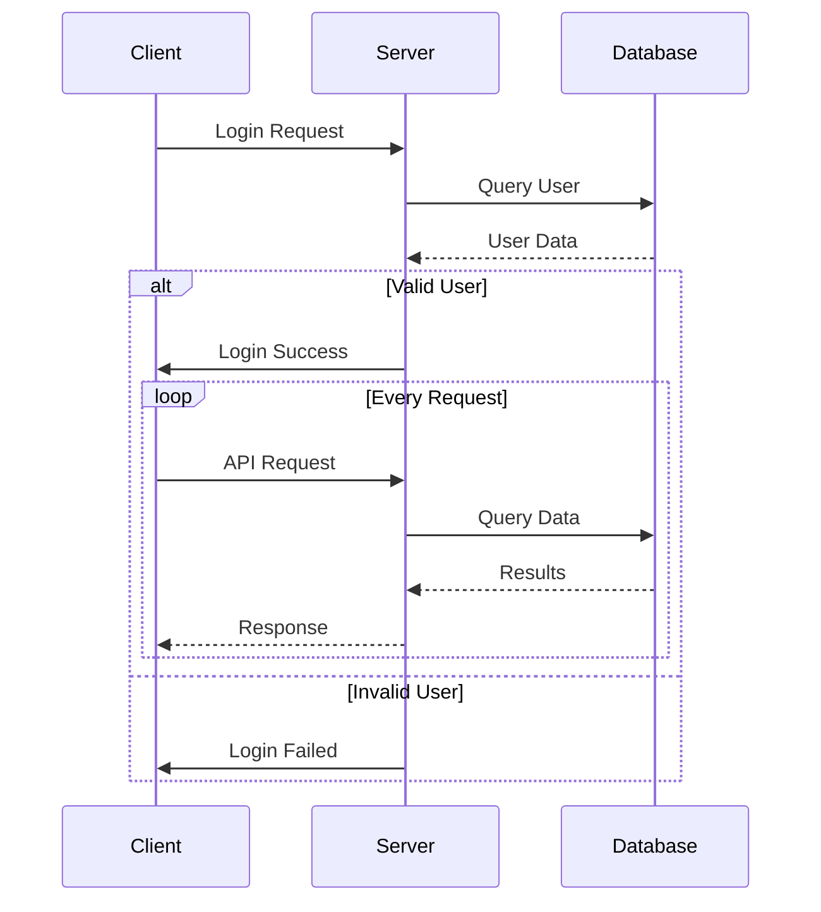

### Sequence Diagram with Notes

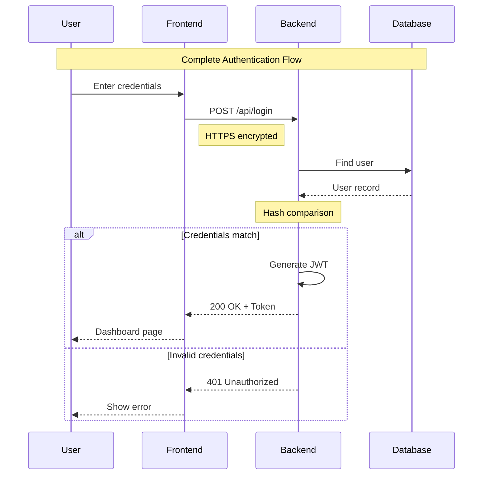

### Complex Sequence Diagram

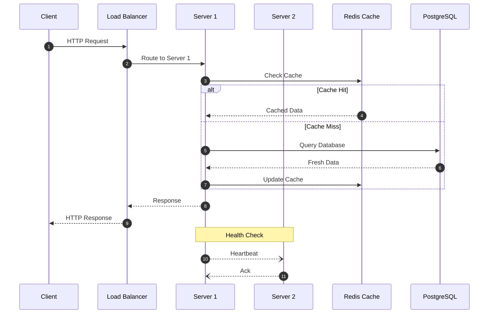

## Class Diagram

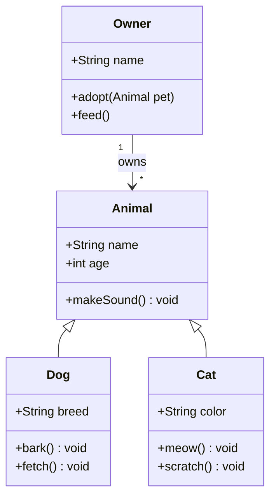

## State Diagram

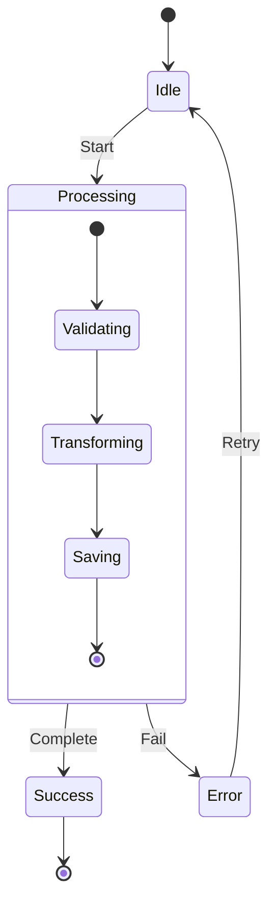

## Entity Relationship Diagram

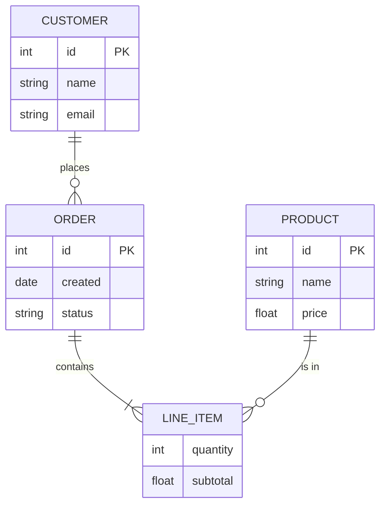

## Pie Chart

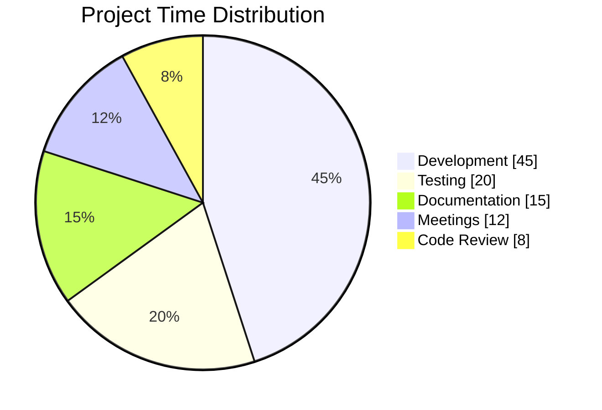

## Gantt Chart

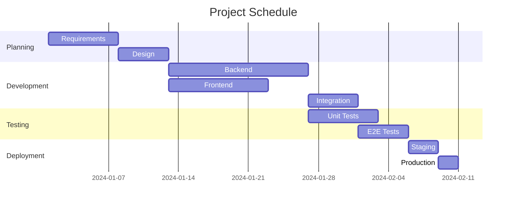