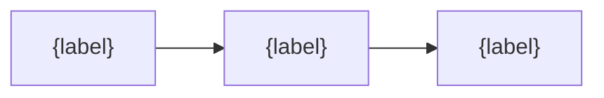

# Chapter Content Format Specification (v1)

> Canonical format for AI-generated learning chapters. Sourced from `docs/specs/content-format-spec.md` and embedded here so the agent can read it without leaving the skill.

## 1. Writing style

1. **深入浅出** (intuitive): use real-life analogies to explain complex concepts
2. **逻辑连贯** (coherent): if there's a next chapter, end with a transition
3. **有自己的思考** (insightful): don't just list facts — explain *why*
4. **适度总结** (summarized): brief summaries after key concepts
5. **可视化** (visual): Mermaid diagrams and tables encouraged

Markdown rules:
- Standard Markdown
- Math: `$...$` inline, `$$...$$` block
- Code blocks: always tag the language (` ```python `, etc.)

## 2. Required learning elements per chapter

| Element | Count | Syntax | Render behavior |
|---------|-------|--------|-----------------|
| `!concept` concept card | ≥ 2 | `> [!concept] Title\n> Content` | Yellow background, hover shows popup |
| `!question` thought question | ≥ 1 | `> [!question] Title\n> Question\n>\n> > [!answer] Answer` | Click to expand |
| `!quiz` self-check | ≥ 1 | `> [!quiz]\n> 1. Question\n>    - A. ...\n>    - B. ... ✓` | Inline check during reading |

## 3. Mandatory chapter structure

Every chapter MUST follow this numbered section template. The structure is designed to ensure consistency across all chapters in a course.

```markdown
# {NN}: {chapter title}

> **预计阅读时间**：{duration} 分钟
>
> **本章目标**：一句话说明本章解决什么问题

---

## 1.1 {first concept}

### 核心直觉

{real-life analogy — 1-2 sentences anyone can relate to}

{technical explanation linking the analogy to the math}

$$
{core formula}
$$

```python
# {code example that illustrates the concept}
```

### {concrete metaphor / scenario name}

{extend the analogy into a concrete scenario showing tradeoffs}



> [!concept]
> **{Concept name}**
> {definition with real-world analogy}

---

## 1.2 {next concept}

### {its core intuition}

...

### {comparison}

| Feature | Approach A | Approach B | Why |
|:---:|:---:|:---:|:---|
| {feature 1} | ✅ | ❌ | {reason} |
| {feature 2} | ❌ | ✅ | {reason} |

---

## 1.{N} 本章总结

{recap of the chapter's arc — 3-5 bullet points or short paragraphs}

> **一句话总结**: {the single most important takeaway}

---

> [!question]
> **{synthesis-level thought question}**
>
> > [!answer]- 查看答案
> >
> > {detailed explanation with reasoning}

---

> [!quiz]
> **小测验**
>
> **1. {question testing understanding, not recall}**
> **A.** {option}
> **B.** {option} ✓
> **C.** {option}
>
> **2. {question}**
> ...
>
> > [!answer]- **查看答案**
> >
> > **1. B** — {explanation}
> > **2. A** — {explanation}

---

## 预告：第 {N+1} 章

{transition sentence connecting what was just learned to what's next}
```

## 4. quiz.json schema (v1)

### 4.1 File location

Same directory as the `.md` file. Same basename, only the extension differs:

```
project/
├── 00-chapter-intro.md
├── 00-chapter-intro.quiz.json
├── 01-...
```

### 4.2 Required structure

```json
{
  "$schema": "quiz.json.v1",
  "chapter_file": "01-神经网络基础.md",
  "chapter_title": "神经网络基础",
  "generated_at": "2026-06-04T10:30:00Z",
  "questions": [
    {
      "id": "q1",
      "qtype": "single",
      "question": "梯度消失和梯度爆炸分别出现在什么场景？",
      "options": [
        {"label": "A", "text": "..."},
        {"label": "B", "text": "..."},
        {"label": "C", "text": "..."}
      ],
      "correct": "A",
      "weak_concepts": ["梯度消失", "激活函数选择"],
      "related_section": "3.2 反向传播的数值稳定性",
      "suggestion": "建议回顾 3.2 节关于激活函数的内容"
    }
  ],
  "adaptive_rules": {
    "mastered_threshold": 0.8,
    "learning_threshold": 0.5,
    "max_questions": 5
  }
}
```

### 4.3 Field requirements

| Field | Type | Required | Notes |
|-------|------|----------|-------|
| `$schema` | string | yes | Always `"quiz.json.v1"` |
| `chapter_file` | string | yes | Filename of the chapter Markdown |
| `chapter_title` | string | yes | Chapter title (matches H1) |
| `generated_at` | string | yes | ISO 8601 timestamp (use current time) |
| `questions` | array | yes | 3–5 questions |
| `questions[].id` | string | yes | `q1`, `q2`, ... |
| `questions[].qtype` | enum | yes | `single` / `multiple` / `short` |
| `questions[].question` | string | yes | Question text |
| `questions[].options` | array | conditional | Required for `single`/`multiple`, empty `[]` for `short` |
| `questions[].options[].label` | string | yes | `A` / `B` / `C` / `D` |
| `questions[].options[].text` | string | yes | Option body |
| `questions[].correct` | varied | yes | `string` for single, `array` for multiple, `null` for short |
| `questions[].weak_concepts` | array | yes | Concepts this tests (drives review schedule) |
| `questions[].related_section` | string | yes | Section title in the chapter, for review hints |
| `questions[].suggestion` | string | yes | Personalized advice when wrong |
| `adaptive_rules` | object | yes | See below |
| `adaptive_rules.mastered_threshold` | number | yes | Default `0.8` |
| `adaptive_rules.learning_threshold` | number | yes | Default `0.5` |
| `adaptive_rules.max_questions` | number | yes | Default `5` |

### 4.4 Question distribution

- 3–5 questions per chapter
- ~60% single-choice, ~20% multiple-choice, ~20% open (`short`)
- Cover the chapter's core concepts, not trivia

### 4.5 ⚠️ CRITICAL: JSON string quoting

**The #1 cause of quiz.json parse errors is unescaped ASCII `"` inside string values.**

If a question text or option text contains Chinese quotes `""`, you MUST either:

```json
// ✅ Option A: use escaped ASCII quotes
"question": "扩散模型的前向过程为什么被称为\"破坏过程\"？",

// ✅ Option B: use Chinese curly quotes (U+201C / U+201D)
"question": "扩散模型的前向过程为什么被称为“破坏过程”？",

// ❌ BAD: bare ASCII quotes break JSON parsing
"question": "扩散模型的前向过程为什么被称为"破坏过程"？",
//                                    ↑ Error here!
```

**Rule**: Every `"` character inside a JSON string value must be `\"` OR a Unicode curly quote (`“` / `”`). Never a bare ASCII `"`.

## 5. Inline `!quiz` vs end-of-chapter `quiz.json`

| | Inline `!quiz` | `quiz.json` (end-of-chapter) |
|--|----------------|------------------------------|
| Purpose | Self-check while reading | Comprehensive mastery assessment |
| Timing | Encountered during reading | Shown at 80% scroll |
| Style | 1–2 simple questions | 3–5 systematic questions |
| Scoring | User self-grades | System scores (mastered/learning/struggling) |
| Same set? | Not necessarily | Independent design |

## 6. concepts.json schema

```json
{
  "chapter": "00-chapter-intro.md",
  "concepts": [
    {
      "id": "self-attention",
      "name": "自注意力机制",
      "depends_on": ["embedding", "softmax"]
    }
  ]
}
```

| Field | Type | Required | Notes |
|-------|------|----------|-------|
| `chapter` | string | yes | The chapter filename |
| `concepts` | array | yes | All core concepts introduced in the chapter |
| `concepts[].id` | string | yes | kebab-case English (e.g. `self-attention`) |
| `concepts[].name` | string | yes | Chinese name displayed in the knowledge graph |
| `concepts[].depends_on` | array | yes | IDs of upstream concepts from **earlier** chapters; empty `[]` if net-new |

## 7. Change log

| Date | Version | Change |
|------|---------|--------|
| 2026-06-04 | v1.0 | Initial version, extracted from implementation plan |
| 2026-06-15 | v1.1 | Embedded into chapter-generation skill (no semantic changes) |
