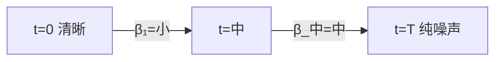
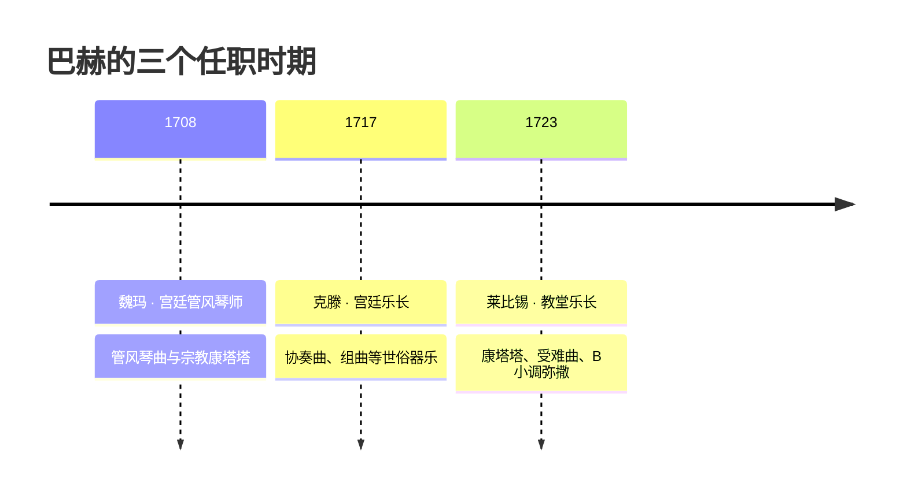
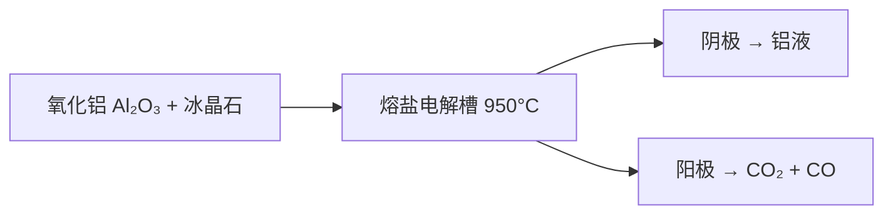

# Chapter Generation — Worked Example

A complete example of a generated chapter + supporting files. Use as a template to mirror style, structure, and field shapes.

> 本例是 **technical（技术课）** 的完整范例。生成 **humanities（人文课）** 章节时，请镜像文末「humanities 片段」的元素形态（timeline 可视化 + 具体作品实例 + 对比表格，**无凑数伪代码**），骨架/callout/quiz 结构与本例一致。

## Setup

- `chapter_index`: 2
- `chapter_title`: "反向过程：去噪原理"
- `duration_minutes`: 25
- `concepts`: ["前向过程", "噪声调度", "反向去噪"]
- `project_path`: `/Users/x/projects/diffusion-model`
- `previous_chapters`: ["为什么学这个", "前向过程：逐步加噪"]

Expected output files:
- `02-反向过程-去噪原理.md`
- `02-反向过程-去噪原理.quiz.json`
- `02-反向过程-去噪原理.concepts.json`

## 1. Markdown: `02-反向过程-去噪原理.md`

```markdown
# 反向过程：去噪原理

> [!concept] 反向过程
> 把一张随机噪声图片逐步"擦亮"回真实图片的过程，可以类比为"修复一张被水泡模糊的老照片"，每一轮都猜出最可能的细节再修一点点。

上一章我们看到了前向过程如何加噪。这一章反过来：能不能从纯噪声开始，"倒着"还原出一张有意义的图片？

## 为什么反向过程是核心

直觉上，去噪听起来比加噪难。给定一张清晰的猫和噪声 → 把它变噪声很容易。但给定噪声 → 还原出猫，这本质上是个**欠定问题**（一张噪声图可能对应无数张原图）。

> [!concept] 条件分布 p(x_{t-1} | x_t)
> 反向过程建模的是"在看到第 t 步的带噪图后，第 t-1 步大概长什么样"。这是一个**条件概率**，由训练数据中学到。

突破口是**只预测噪声**（不直接预测上一时刻的图）。

## 算法骨架

```python
# 训练时（很简化）
for x0 in dataloader:
    t = sample_timestep()
    noise = torch.randn_like(x0)
    xt = add_noise(x0, noise, t)
    pred_noise = model(xt, t)
    loss = mse(pred_noise, noise)

# 采样时
xt = torch.randn_like(shape)
for t in [T, T-1, ..., 1]:
    pred_noise = model(xt, t)
    xt = denoise_step(xt, pred_noise, t)
return xt
```

> [!question] 为什么"只预测噪声"比"直接预测 x_{t-1}"效果更好？
>
> > [!answer] 噪声的分布更简单（接近高斯），神经网络擅长拟合简单分布。直接预测图片的方差太大，每一步的不确定性都会累积。

## 噪声调度 β_t

不是所有时间步的加噪量都均匀。常用 **cosine schedule**：



| 调度方式 | 特点 |
|----------|------|
| 线性 | 简单，但尾部过吵，破坏信息太快 |
| cosine | 端点附近变化慢，中段变化快，主流选择 |
| sigmoid | 介于两者之间 |

> [!quiz]
> 1. 反向过程预测的目标是？
>    - A. x_{t-1} 完整图片 ✓
>    - B. 加入的噪声 ε
>    - C. 时间步 t 本身

## 总结

反向过程 = 迭代去噪，每一步只预测噪声；调度函数 β_t 决定加噪/去噪的节奏。下一章我们把前向+反向拼起来，看完整的 DDPM 训练循环。

> [!concept] DDPM
> Denoising Diffusion Probabilistic Model，把前向加噪和反向去噪组合成完整的生成模型。训练 = 学噪声预测器；推理 = 迭代去噪。
```

## 2. Quiz: `02-反向过程-去噪原理.quiz.json`

```json
{
  "$schema": "quiz.json.v1",
  "chapter_file": "02-反向过程-去噪原理.md",
  "chapter_title": "反向过程：去噪原理",
  "generated_at": "2026-06-15T10:30:00Z",
  "questions": [
    {
      "id": "q1",
      "qtype": "single",
      "question": "DDPM 训练时，神经网络的预测目标是？",
      "options": [
        {"label": "A", "text": "上一时刻的图片 x_{t-1}"},
        {"label": "B", "text": "加入的噪声 ε"},
        {"label": "C", "text": "时间步 t 的值"}
      ],
      "correct": "B",
      "weak_concepts": ["反向过程", "训练目标"],
      "related_section": "算法骨架",
      "suggestion": "回顾'为什么只预测噪声'那一节"
    },
    {
      "id": "q2",
      "qtype": "multiple",
      "question": "以下哪些是常用的噪声调度 β_t 方案？",
      "options": [
        {"label": "A", "text": "线性调度"},
        {"label": "B", "text": "cosine 调度"},
        {"label": "C", "text": "指数调度（不常见）"},
        {"label": "D", "text": "随机调度"}
      ],
      "correct": ["A", "B"],
      "weak_concepts": ["噪声调度", "前向过程"],
      "related_section": "噪声调度 β_t",
      "suggestion": "主流是 cosine，端点附近变化慢"
    },
    {
      "id": "q3",
      "qtype": "short",
      "question": "用自己的话解释：为什么'只预测噪声'比'直接预测上一时刻图片'更好？",
      "options": [],
      "correct": null,
      "weak_concepts": ["反向过程", "训练目标"],
      "related_section": "为什么反向过程是核心",
      "suggestion": "想一下分布复杂度和误差累积"
    },
    {
      "id": "q4",
      "qtype": "single",
      "question": "DDPM 推理时，从纯噪声还原图片的过程是？",
      "options": [
        {"label": "A", "text": "一次前向计算直接出图"},
        {"label": "B", "text": "迭代去噪，每步预测噪声并更新"},
        {"label": "C", "text": "查训练集找最相似的"}
      ],
      "correct": "B",
      "weak_concepts": ["采样过程", "反向过程"],
      "related_section": "算法骨架",
      "suggestion": "采样循环就是反向过程的迭代"
    }
  ],
  "adaptive_rules": {
    "mastered_threshold": 0.8,
    "learning_threshold": 0.5,
    "max_questions": 5
  }
}
```

## 3. Concepts: `02-反向过程-去噪原理.concepts.json`

```json
{
  "chapter": "02-反向过程-去噪原理.md",
  "concepts": [
    {
      "id": "reverse-process",
      "name": "反向过程",
      "depends_on": ["forward-process", "noise-schedule"]
    },
    {
      "id": "noise-prediction",
      "name": "噪声预测",
      "depends_on": ["forward-process"]
    },
    {
      "id": "ddpm",
      "name": "DDPM",
      "depends_on": ["reverse-process", "noise-prediction"]
    }
  ]
}
```

## 4. What the agent returns to the host

After writing all three files, return a single short text line as the assistant message:

```
第 2 章已生成: 反向过程：去噪原理, 4 个测验题, 3 个概念
```

The host uses this to emit a `chapter_complete` event with `{index, file, title}` to update the UI.

## 5. humanities 片段（人文课示例——镜像此形态，非技术课内容）

以音乐鉴赏课「巴赫的生平与时代」为例，节选一个完整小节。注意三个关键差异：**无代码块**、时间演变用 `timeline`（不是 flowchart）、具体作品实例落到乐章与时间点。

```markdown
## 1.2 莱比锡时期：教堂乐长的二十七年

### 核心直觉

想象一位同时身兼" content 创作者、乐团总监、 choir 教练"的音乐总监——每周日都要交付一部新作品，还要兼顾学校和城市仪式。巴赫在莱比锡的日常正是如此。

1723 年起，巴赫担任圣托马斯教堂乐长，负责为每周礼拜提供康塔塔。这是一场持续 27 年的"周更马拉松"——现存 200 多部教堂康塔塔大多诞生于此。

> 🎧 **具体作品实例**：听《康塔塔 BWV 147》第十乐章"耶稣，世人仰望的喜悦"（Jesu, Joy of Man's Desiring）0'00'' 起
> 的弦乐拨奏与双簧管旋律——最耳熟能详的"巴赫味道"，就来自这种周复一周的礼拜音乐传统。



| 时期 | 雇主类型 | 代表体裁 | 为什么 |
|:---:|:---:|:---:|:---|
| 魏玛 | 宫廷 | 管风琴曲 | 职责是演奏，键盘作品自然多产 |
| 克滕 | 宫廷 | 协奏曲/组曲 | 亲王热爱器乐，无需礼拜音乐 |
| 莱比锡 | 教会/市政 | 康塔塔/受难曲 | 每周礼拜的刚性需求 |

> [!concept]
> **康塔塔 (Cantata)**
> 一种多乐章的声乐套曲，像"一部微型宗教歌剧"——用合唱、咏叹调、宣叙调讲述当周福音主题，是巴赫莱比锡时期的周更产物。

> [!question]
> **为什么巴赫最伟大的宗教作品（受难曲、B 小调弥撒）都出现在任务最繁重的莱比锡时期，而不是相对清闲的克滕？**
>
> > [!answer]- 查看答案
> >
> > 刚性的"周更"需求既是负担也是熔炉：持续的创作压力 + 教会委约的明确场景（受难节需受难曲），让宗教体裁得以系统化地深耕。克滕时期任务清闲，产出转向器乐——说明体裁繁荣往往由"需求结构"而非"闲暇多少"决定。
```

---

## engineering 课片段镜像（电解铝/半导体刻蚀等工业过程课）

> 用于展示 engineering 分支：真公式 + 工艺/结构 mermaid + 真实工业实例，**无编程代码块**。

```markdown
# 01: 电解法制铝——从氧化铝到铝锭

> **预计阅读时间**：20 分钟
> **本章目标**：弄清霍尔-埃鲁法为什么能把铝从氧化铝里"烙"出来

## 1.1 为什么不能直接碳还原氧化铝

### 核心直觉

想象做饭时铁锅里的油——氧化铝太"亲和"氧、太稳定，用碳去还原需要 2000°C 以上
（比铝熔点高一大截），工业上不可行。于是人类改走"电解"这条路：先把氧化铝溶进
冰晶石熔盐降低熔点，再用直流电把铝离子在阴极还原成铝。

$$\text{阴极}\;\; \mathrm{Al^{3+} + 3e^- \rightarrow Al}$$



> 🏭 **真实工业实例**：现代 400kA 预焙阳极电解槽，槽电压约 4.1~4.3V，
> 吨铝直流电耗约 1.3 万 kWh，阳极电流密度约 0.8 A/cm²——这些是设计
> 电解槽产能与能耗的真实量级。

> [!concept]
> **电流效率**
> 实际产铝量与法拉第定律理论产铝量之比（一般 90%+）。电流效率越低，无用电流
> （铝的返溶、阳极反应损耗）占比越高，直接抬高吨铝电耗。

> [!question]
> **为什么电解铝耗电惊人，却仍是全球铝工业的统一主流路线？**
>
> > [!answer]- 查看答案
> >
> > 因为碳还原氧化铝在热力学上不现实（反应需要超高温），而电解虽有 1.3 万
> > kWh/t 的代价，却能在 950°C 熔盐里稳定规模化生产——这是"能量换可行"的
> > 工程取舍，也是一座电解槽动辄数百 kA 电流的原因。
```

<!-- 三种类型对照（只读参考）：
technical → 代码示例 + 公式 + flowchart/sequence
engineering → 真公式 + 工艺/结构 mermaid + 真实工业实例（无编程代码块）★
humanities → 具体作品实例 + timeline/mindmap（无编程代码块）
-->
