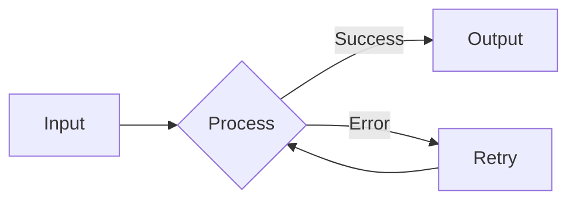
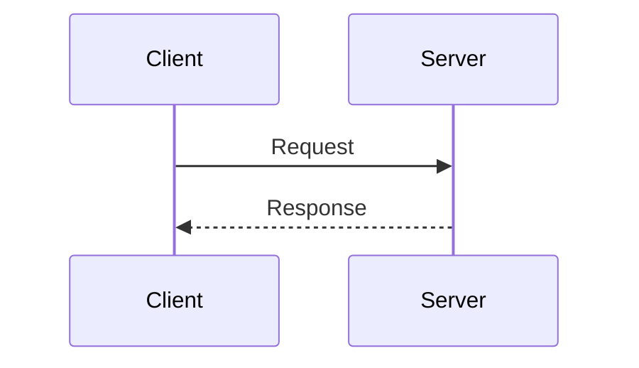
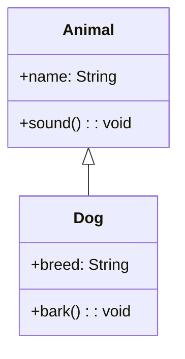

# Comprehensive Markdown Test

This document combines all Markdown features for complete rendering verification.

---

## 1. Headings (H1-H6)

# Heading Level 1

## Heading Level 2

### Heading Level 3

#### Heading Level 4

##### Heading Level 5

###### Heading Level 6

---

## 2. Text Formatting

Normal paragraph text with **bold**, *italic*, and `inline code`.

Combined formatting: **bold with *italic* inside**, ~~strikethrough~~, and ***bold italic***.

Escaped characters: \*not italic\*, \**not bold\**, \`not code\`.

---

## 3. Lists

### Unordered List

- First item
- Second item
  - Nested item A
  - Nested item B
    - Deep nested
- Third item

### Ordered List

1. Step one
2. Step two
   1. Sub-step 2.1
   2. Sub-step 2.2
3. Step three

### Task List

- [x] Completed task
- [ ] Pending task
- [x] Another done item

---

## 4. Links and Images

Inline link to [Example](https://example.com).

Reference-style link to [GitHub][github].

[github]: https://github.com


---

## 5. Blockquotes

> Simple blockquote.
>
> Multiple paragraphs.

> Nested structure:
>
> > Deeper level.
> >
> > > Even deeper.

> Mixed content:
>
> - List item
> - **Bold text**
>
> ```python
> print("Code in blockquote")
> ```

---

## 6. Code Blocks

### Python

```python
def greet(name: str) -> str:
    """Return a greeting message."""
    return f"Hello, {name}!"

if __name__ == "__main__":
    print(greet("World"))
```

### JavaScript

```javascript
const greet = (name) => `Hello, ${name}!`;
console.log(greet("World"));
```

### Rust

```rust
fn greet(name: &str) -> String {
    format!("Hello, {}!", name)
}

fn main() {
    println!("{}", greet("World"));
}
```

---

## 7. Tables

| Feature | Status | Notes |
|:--------|:------:|------:|
| Basic syntax | Done | Core complete |
| GFM tables | Done | Alignment works |
| Task lists | Done | Interactive |

### Table with Formatting

| Command | Description |
|---------|-------------|
| `git init` | **Initialize** repository |
| `git commit` | Save *changes* |
| `git push` | Upload to [GitHub](https://github.com) |

---

## 8. Mathematics

### Inline Math

Euler's identity: $e^{i\pi} + 1 = 0$

Quadratic formula: $x = \frac{-b \pm \sqrt{b^2 - 4ac}}{2a}$

### Block Math

$$
\int_{-\infty}^{\infty} e^{-x^2} \, dx = \sqrt{\pi}
$$

$$
\sum_{n=1}^{\infty} \frac{1}{n^2} = \frac{\pi^2}{6}
$$

### Matrix

$$
A = \begin{pmatrix}
a_{11} & a_{12} & a_{13} \\
a_{21} & a_{22} & a_{23} \\
a_{31} & a_{32} & a_{33}
\end{pmatrix}
$$

---

## 9. Mermaid Diagrams

### Flowchart



### Sequence Diagram



### Class Diagram



---

## 10. GFM Alerts

> [!NOTE]
> This is a note for important information.

> [!TIP]
> Helpful advice for better usage.

> [!WARNING]
> Caution about potential issues.

> [!CAUTION]
> Warning about possible negative outcomes.

---

## 11. Horizontal Rules

Above the line.

---

Below the line.

***

Asterisks also work.

___

Underscores too.

---

## 12. Mixed Complex Content

### Code with Math

The time complexity is $O(n \log n)$:

```python
def merge_sort(arr):
    if len(arr) <= 1:
        return arr
    mid = len(arr) // 2
    return merge(merge_sort(arr[:mid]), merge_sort(arr[mid:]))
```

### Table with Code and Math

| Algorithm | Complexity | Example |
|-----------|------------|---------|
| Binary Search | $O(\log n)$ | `arr.binary_search()` |
| Quick Sort | $O(n \log n)$ | `quicksort(arr)` |
| Hash Lookup | $O(1)$ | `hashmap.get(key)` |

### Task List with Math

- [x] Prove $\sum_{i=1}^{n} i = \frac{n(n+1)}{2}$
- [ ] Implement $\int_0^1 x^2 \, dx$
- [x] Calculate $\lim_{x \to 0} \frac{\sin x}{x} = 1$

---

## 13. Nested Structures

> **Complex Blockquote**
>
> This blockquote contains:
>
> 1. An ordered list
> 2. With multiple items
>
> And a table:
>
> | A | B |
> |---|---|
> | 1 | 2 |
>
> Plus some math: $E = mc^2$
>
> ```mermaid
> flowchart TD
>     A --> B
> ```

---

## 14. Final Combination Test

| Type | Inline | Block |
|------|--------|-------|
| Text | **bold**, *italic* | Paragraph |
| Code | `code` | ```code block``` |
| Math | $x^2$ | $$x^2$$ |
| Link | [url](https://example.com) | - |
| Image |  | - |

**End of comprehensive test document.**