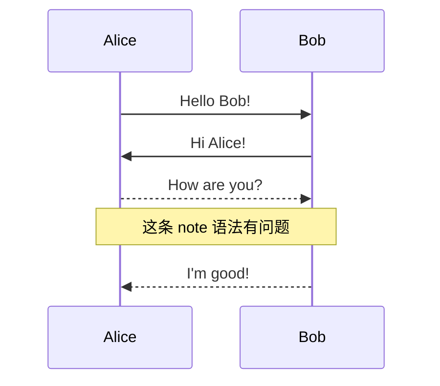
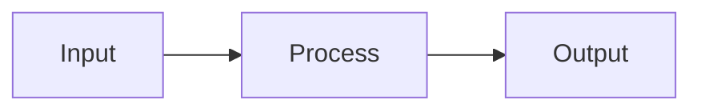

# Mermaid Error Test

## 语法错误的流程图

```mermaid
flowchart TD
    A[Start] --> B{Is it working?}
    B -->|Yes| C[Great!]
    B -->|No| D[Debug]
    D --> B
    C --> E[End
```

上面的图表故意少了一个右括号 `]`，Mermaid 会报语法错误。

## 另一个错误：非法字符



## 正确的图表（对比用）


